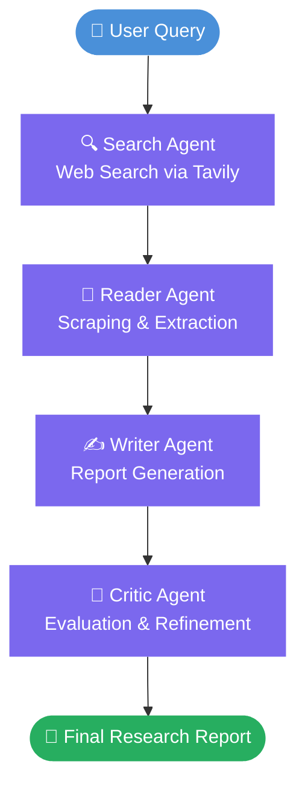
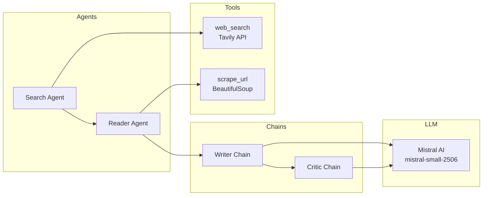

# Multi-Agent Research Assistant

A multi-agent AI system that performs web research, extracts relevant information, generates structured reports, and evaluates its own output — all in a single automated pipeline.

---

## Overview

This project implements a modular, multi-agent architecture using LangChain and Mistral AI. Given a user query, the system autonomously searches the web, reads and extracts content from relevant URLs, synthesizes the findings into a well-structured research report, and then critiques the output for quality and accuracy.

It is designed to be extensible — each agent and module can be swapped or upgraded independently without breaking the rest of the pipeline.

---

## Features

- **Web Search** — Uses the Tavily API to find relevant, up-to-date sources for any topic.
- **URL Scraping** — Reads and extracts clean content from web pages using BeautifulSoup.
- **Multi-Agent System** — A dedicated Search Agent and Reader Agent handle distinct responsibilities in the pipeline.
- **Structured Report Generation** — A writer chain produces reports with clear Introduction, Key Findings, Conclusion, and Sources sections.
- **Critic Module** — An LLM-powered critic evaluates reports and provides a score, strengths, and areas to improve.
- **Modular Pipeline** — Each stage is independently structured, making the system easy to debug, extend, or replace.

---

## How It Works

The system follows a sequential pipeline where each step feeds into the next:



---

## Architecture

```
multi-agent-research-assistant/
│
├── app.py               # Entry point — accepts user query, runs pipeline
├── pipeline.py          # Orchestrates the full multi-agent workflow
├── agents.py            # Defines Search Agent, Reader Agent, Writer, and Critic
├── tools.py             # Web search (Tavily) and URL scraping (BeautifulSoup)
├── requirements.txt     # Python dependencies
└── .env                 # API keys (not committed to version control)
```

### Component Diagram



---

## Tech Stack

| Component | Technology |
|-----------|------------|
| Language | Python |
| LLM Framework | LangChain |
| Language Model | Mistral AI (`mistral-small-2506`) |
| Web Search | Tavily API |
| Web Scraping | BeautifulSoup |
| Config Management | python-dotenv |

---

## Project Structure

```
multi-agent-research-assistant/
├── agents.py        # All agent definitions: search agent, reader agent, writer chain, critic chain
├── tools.py         # Tool implementations: web_search and scrape_url
├── pipeline.py      # Main pipeline — ties all agents together end to end
├── app.py           # Application entry point
├── requirements.txt # Project dependencies
└── .env             # Environment variables (API keys)
```

---

## Setup

### 1. Clone the Repository

```bash
git clone https://github.com/Tanishq123467658/multi-agent-research-assistant.git
cd multi-agent-research-assistant
```

### 2. Install Dependencies

```bash
pip install -r requirements.txt
```

### 3. Configure Environment Variables

Create a `.env` file in the root directory and add your API keys:

```env
TAVILY_API_KEY=your_tavily_api_key_here
MISTRAL_API_KEY=your_mistral_api_key_here
```

### 4. Run the Pipeline

```bash
python pipeline.py
```

---

## Example Use Cases

- **Technology Research** — "What are the latest advancements in quantum computing?"
- **Market Analysis** — "Summarize recent trends in the electric vehicle industry."
- **Academic Background** — "What is the current state of research on large language models?"
- **Event Summaries** — "What happened at the 2025 UN Climate Conference?"
- **Competitive Intelligence** — "Compare the features of the top open-source LLMs available today."

---

## Limitations

- **Rate Limits** — Both Tavily and Mistral APIs have rate limits; large or rapid queries may be throttled.
- **Scraping Reliability** — Some websites block automated scraping or use JavaScript-heavy rendering that BeautifulSoup cannot parse.
- **Hallucination Risk** — The LLM may still generate inaccurate claims despite grounding in search results. The critic module helps surface these issues but does not eliminate them.
- **No Memory** — The system does not retain context between separate runs; each query starts fresh.
- **Sequential Pipeline** — Agents run one after the other. There is no parallelism in the current implementation.

---

## Future Improvements

- [ ] Add parallel search and reading for faster performance
- [ ] Introduce a planning agent to decompose complex queries into sub-tasks
- [ ] Support follow-up queries with conversation memory
- [ ] Add a confidence score per claim in the generated report
- [ ] Build a simple web UI using Streamlit or Gradio
- [ ] Export reports as PDF or Markdown files
- [ ] Add support for additional LLM providers (OpenAI, Claude, etc.)

---

## Author

**Tanishq**
[Linkedin Profile](https://www.linkedin.com/in/tanishq-battul-88056a323/)

---

> Built with LangChain, Mistral AI, and Tavily. Designed to make AI-powered research fast, structured, and self-evaluating.
